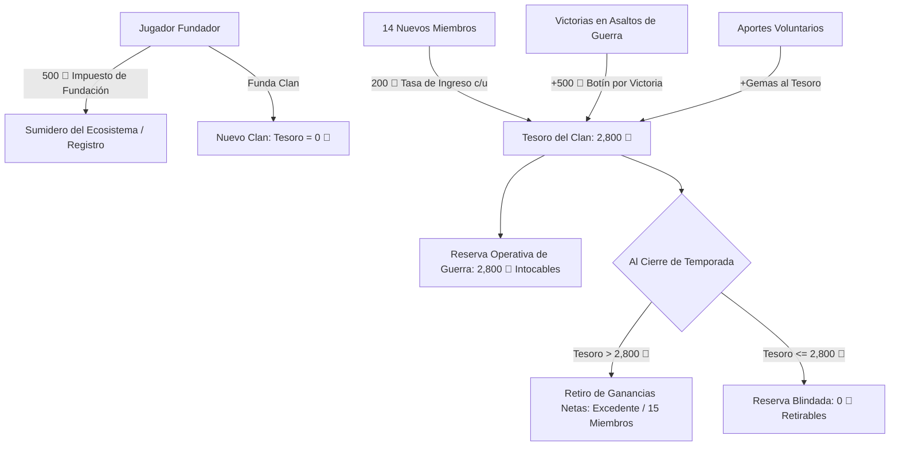
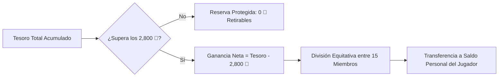

# PLANT ARENA — WHITEPAPER: SISTEMA DE CLANES & ECONOMÍA DEL TESORO
**Versión:** 2.0  
**Fecha:** Septiembre 2026  
**Ecosistema:** Plant Arena (PVP & Guild Ecosystem)  
**Moneda Base del Sistema:** Gemas 💎  

---

## 1. Resumen Ejecutivo

El **Sistema de Clanes de Plant Arena** es una infraestructura competitiva, social y financiera de alto rendimiento diseñada para fomentar la cooperación estratégica entre jugadores, la acumulación colectiva de capital y el combate asimétrico de guerra de clanes.

A diferencia de los gremios convencionales de videojuegos, los clanes en Plant Arena operan bajo un modelo de **bóveda soberana auditada (Clan Vault)** respaldada en contratos de base de datos autoritativos (PostgreSQL en Supabase). Cada clan gestiona un fondo en Gemas 💎 alimentado por el compromiso económico de sus miembros, protegido por una **Reserva Operativa de Guerra** intocable de **2,800 Gemas 💎**, y con la capacidad de generar y retirar utilidades netas en base a su desempeño en combates de asalto.

---

## 2. Arquitectura de Membresía y Plazas

Cada clan está dimensionado estrictamente para mantener un equilibrio entre agilidad estratégica y masa crítica competitiva:

* **Capacidad Máxima:** 15 plazas por clan.
* **Composición de Plazas:**
  * **1 Líder Fundador:** Creador del clan y máximo responsable directivo.
  * **14 Miembros / Oficiales:** Jugadores incorporados mediante pago de cuota de ingreso.
* **Jerarquía y Roles:**
  * **Líder (Leader):** Control total de ajustes, gobernanza, expulsiones y declaración de asaltos.
  * **Colíder (Co-leader):** Oficiales designados con privilegios de gestión de miembros y guerra.
  * **Veterano (Elder):** Miembros destacados reconocidos por antigüedad o donaciones.
  * **Miembro (Member):** Integrantes activos en el circuito de combate y donaciones.

---

## 3. Tokenomics y Mecánica Financiera del Tesoro

### 3.1. Tasa de Fundación (Cost to Create)
* **Costo:** 500 Gemas 💎.
* **Naturaleza Económica:** Es un **impuesto de registro del ecosistema (Token Sink)**.
* **Impacto en el Tesoro:** **0 Gemas entran a la bóveda del clan**. El Tesoro arranca estrictamente en:
  $$V_0 = 0 \text{ Gemas 💎}$$
* **Justificación:** Previene la creación masiva de clanes fantasma, combate el spam y garantiza que solo líderes comprometidos funden organizaciones activas.

### 3.2. Tasa de Ingreso de Miembros (Entry Fee)
* **Costo:** 200 Gemas 💎 por cada miembro que solicite o acepte unirse.
* **Destino:** **100% inyectado directamente al Tesoro del Clan**.
* Cada jugador invierte en el patrimonio de su nuevo equipo, alineando los incentivos de todos los integrantes con la supervivencia de la base.

### 3.3. La Reserva Operativa de Guerra (2,800 Gemas 💎)
Cuando un clan completa sus 15 posiciones (1 Líder + 14 Miembros), el capital base acumulado alcanza:
$$\text{Fondo Base} = 14 \text{ miembros} \times 200 \text{ Gemas} = \mathbf{2,800 \text{ Gemas 💎}}$$

Este monto de **2,800 Gemas 💎** constituye la **Reserva Operativa de Guerra (War Reserve)**:
1. **Intocable para Repartos:** No puede ser liquidada ni retirada al final de temporada.
2. **Propósito:** Actúa como el respaldo de solvencia que permite al clan participar en eventos de guerra, absorber asaltos defensivos y solventar los gastos de operación del gremio.

### 3.4. Aportes Voluntarios e Incentivos (+Tickets de Coliseo)
Cualquier miembro puede realizar aportes adicionales de Gemas al Tesoro (opciones estándar: 100, 200, 500, 1,000, 2,000 💎) para fortalecer la economía del clan.
* **Recompensa Inmediata al Donante:** Por cada 100 Gemas aportadas voluntariamente, el jugador recibe automáticamente:
  * **+1 Ticket de Entrada al Coliseo 🎟️**.
  * **+1 Giro Gratuito en la Ruleta de la Suerte 🎡**.

---

## 4. Guerra de Clanes (Mini-Torneo de Sábados)

### 4.1. Ventana de Guerra y Formato de Mini-Torneo (4 vs 4)
* **Día de Guerra:** Las guerras de clanes se disputan los **sábados** dentro de una ventana de tiempo competitiva (horario oficial a coordinar por temporada).
* **Desafío entre Líderes:** El líder de un clan envía un desafío directo a otro clan rival.
* **Plazo de Respuesta (30 Minutos):** Al emitirse el desafío, el clan rival dispone de un plazo máximo de **media hora (30 minutos)** para responder, aceptar el reto y reunir a sus representantes.
* **Entrada a Lobby y Mini-Torneo (4 vs 4):**
  * Cada clan selecciona a sus **4 mejores jugadores** activos para representar al equipo.
  * Ambos bandos ingresan a un lobby especial de torneo en formato de enfrentamientos individuales (todos contra todos / duelos 1 vs 1 entre los 4 de cada lado).
* **Sin Vida de Base:** Las contiendas no involucran puntos de vida ni daño a bases o torres. Se resuelven de forma pura a través de **batallas individuales PvP** entre los jugadores seleccionados.
* **Botín en Juego (500 Gemas 💎):** El clan que sume el mayor número de victorias individuales al término de los enfrentamientos se proclama vencedor y se adjudica **500 Gemas 💎** directamente del Tesoro rival.

### 4.2. Escudos de Protección (Shields)
* **Escudo Defensivo de 4 Horas:** Tras sufrir una derrota en un desafío de guerra, el clan derrotado recibe automáticamente un escudo temporal de 4 horas durante el cual no puede recibir nuevos desafíos. Esto garantiza tiempo para reorganizarse y planificar la revancha.

### 4.3. Estado de Derrota (Defeated State) y Reactivación por Tesoro
* **Causa de Derrota:** Si tras derrotas consecutivas el Tesoro de un clan desciende hasta **0 Gemas 💎**, el clan entra en **Estado de Derrota (Defeated State)**:
  * Se inhabilitan las solicitudes de semillas entre compañeros.
  * Se bloquea la emisión de nuevos desafíos de guerra.
* **Mecanismo de Reactivación (Fondo Mínimo de 500 Gemas):**
  * **Requisito:** Para salir del Estado de Derrota y reactivar todas las funciones y guerras, **el fondo del Tesoro del clan debe volver a acumular un mínimo de 500 Gemas 💎**.
  * **Aportes Colectivos:** No se requiere que un solo jugador pague las 500 gemas de golpe. Todos los miembros del clan pueden colaborar realizando donaciones voluntarias (en cuotas de 50, 100, 200 gemas, etc.).
  * **Reactivación Automática:** En el instante en que el Tesoro acumulado alcanza o supera las 500 Gemas 💎, el clan se reactiva automáticamente (`status = 'active'`).

### 4.4. Política de Fair Play (Anti-Bullying)
Para evitar que clanes dominantes abusen de gremios en formación o en crisis:
* **Regla Top 3:** Los 3 clanes con mayor Tesoro del servidor tienen prohibido asaltar a clanes que registren un balance negativo histórico (más derrotas que victorias acumuladas).

---

## 5. Liquidación y Retiro de Ganancias de Temporada

Las temporadas de Plant Arena tienen un ciclo regular de **30 días**.

### 5.1. Regla del Excedente Retirable
Al concluir la temporada:
1. **La Reserva de 2,800 Gemas 💎 permanece resguardada en el clan** para asegurar la continuidad de las guerras en la temporada entrante.
2. Solo las **utilidades netas por encima de las 2,800 Gemas** (generadas mediante victorias en asaltos y depósitos) son elegibles para liquidación.
3. **Fórmula Matemática:**
   $$\text{Ganancia Retirable Total} = \max(0, \text{Tesoro Total} - 2800)$$
   $$\text{Cuota Individual por Miembro} = \left\lfloor \frac{\text{Ganancia Retirable Total}}{\text{Número de Miembros}} \right\rfloor$$

### 5.2. Ejemplo Numérico
* **Escenario A (Clan con Éxito de Guerra):**
  * Tesoro al día 30: **4,300 Gemas 💎** (2,800 reserva + 1,500 de 3 asaltos ganados).
  * Excedente retirable: $4,300 - 2,800 = \mathbf{1,500 \text{ Gemas 💎}}$.
  * Con 15 miembros: cada integrante retira **100 Gemas 💎** a su saldo personal.
  * El clan arranca la siguiente temporada con su Reserva de 2,800 💎 intacta.
* **Escenario B (Clan sin Ganancias Excedentes):**
  * Tesoro al día 30: **2,800 Gemas 💎** o menos.
  * Excedente retirable: **0 Gemas 💎**.
  * El sistema marca *"Reserva Protegida"*; ningún miembro retira fondos porque el capital operativo debe preservarse.

---

## 6. Sistema Cooperativo de Donaciones de Semillas

Para acelerar la progresión del mazo sin alterar la economía del mercado:
* **Frecuencia de Petición:** 1 solicitud por jugador cada **24 horas**.
* **Capacidad de Recepción:** Hasta **3 copias** donadas por petición.
* **Restricción de Rareza:** Plantas comunes, raras y épicas (las plantas legendarias como *Melonpult* están excluidas para preservar su exclusividad).
* **Mecánica Atómica:** Cuando un compañero dona una carta, esta se deduce de su inventario (`plant_copies`) y se añade en tiempo real al inventario del solicitante mediante transacción de base de datos.
* **Estadísticas de Cooperación:** El clan registra un contador permanente de `donated_count` para identificar a los miembros más solidarios.

---

## 7. Gobernanza y Reglamento de Convivencia

### 7.1. Ajustes del Clan
El Líder y Colíderes pueden personalizar las directrices del clan:
1. **Privacidad:**
   * *Abierto:* Ingreso directo de cualquier jugador con 200 Gemas.
   * *Con Solicitud:* Requiere revisión y aprobación de la directiva.
   * *Cerrado:* Admisión exclusivamente mediante invitación.
2. **Requisito de ELO Mínimo:** Filtro de entrada (0, 1,000, 1,500 o 2,000 copas).
3. **Permisos de Guerra:**
   * *Solo Líder y Colíderes:* Control táctico exclusivo para declarar asaltos.
   * *Todos los Miembros:* Autonomía abierta para que cualquier miembro inicie asaltos.
4. **Aprobación Automática:** Admisión inmediata para postulantes que cumplan con el ELO y el pago.

### 7.2. Reglamento de Expulsión Justa y Blindaje de Guerreros Activos
Para evitar despidos injustos antes del reparto de temporada:
* **👑 Líder Inmune:** El fundador no puede ser expulsado por nadie.
* **🛡️ Guerrero Blindado (Protección Activa):** Cualquier miembro que haya participado en **2 o más rondas de guerra** en la temporada actual queda **blindado contra expulsión** hasta el cierre de la misma.
* **Causales Legítimas de Expulsión:**
  * **Inactividad Comprobada:** No participar en **2 o más rondas consecutivas** de guerra (2 semanas seguidas sin asistencia).
  * **Falta por W.O. (Walkover):** Registrar al menos **1 derrota por abandono** al no presentarse a un combate programado.

### 7.3. Hito de Clan Completo (15/15)
* Al completar por primera vez los 15 miembros activos, cada jugador del clan tiene derecho a reclamar:
  * **2 Sobres Pack Verde Básico 🎁**.
* Esta recompensa está protegida a nivel de cuenta para evitar explotación mediante rotación entre clanes.

---

## 8. Seguridad, Integridad y Auditoría Permanente

Toda la operativa del sistema de Clanes está regida por funciones seguras `SECURITY DEFINER` en PostgreSQL (Supabase):

| Función RPC | Parámetros | Comportamiento Financiero / Operativo |
|---|---|---|
| `create_clan` | `name, tag, badge, desc` | Descuenta 500 💎 de tasa; crea el clan con $V_0 = 0$; asigna líder. |
| `join_clan` | `p_clan_id` | Descuenta 200 💎; suma +200 💎 al `vault_gems`; valida 15 miembros máx. |
| `repair_clan_base` | — | Descuenta 500 💎 (donado por cualquiera); reactiva las funciones del clan y permite participar en guerras. |
| `deposit_to_clan_vault`| `p_amount` | Descuenta monto; suma a `vault_gems`; emite tickets de coliseo (+1 cada 100 💎). |
| `claim_season_clan_earnings` | — | Liquida cuota individual sobre el excedente de 2,800 💎 hacia `profiles.gems_balance`. |
| `request_clan_plant_donation` | `p_plant_id` | Publica petición en el clan con cooldown estricto de 24 horas. |
| `donate_clan_plant_copy` | `p_donation_id` | Transferencia atómica de 1 carta entre donante y receptor. |

Todas las operaciones críticas (creación, ingresos, salidas, expulsiones, depósitos, asaltos y reparaciones) se registran de forma inmutable en la tabla:
`public.clan_audit_logs`

---

## 9. Conclusión

El modelo de Clanes de Plant Arena equilibra la **diversión cooperativa**, el **desafío competitivo** y la **sostenibilidad económica**:
* Los 500 💎 de fundación eliminan el spam y queman liquidez.
* Los 200 💎 de ingreso capitalizan la Bóveda del Clan de forma transparente.
* La **Reserva Operativa de 2,800 💎** dota al clan de un patrimonio intocable para defender su base.
* El reparto de **ganancias netas al fin de temporada** premia el esfuerzo, la constancia y la victoria en el campo de batalla.
